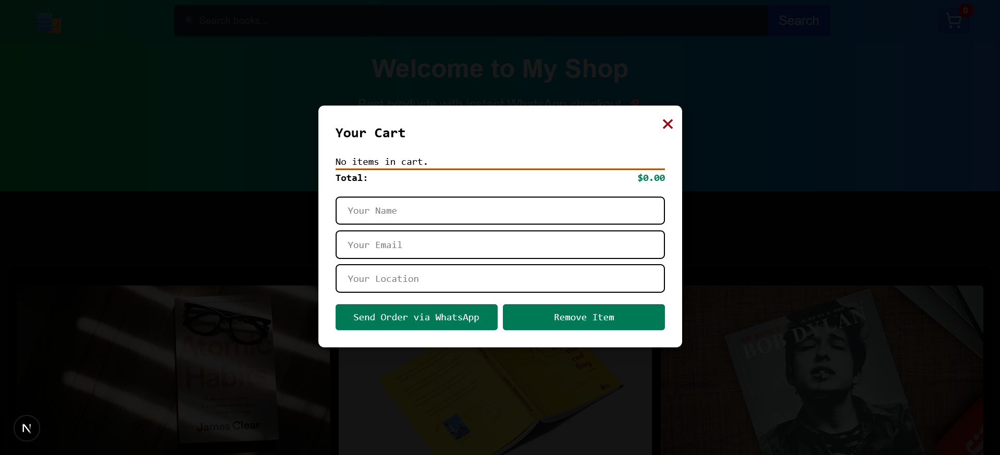

# 🛒 React E-Commerce whatsapp Cart System

A modern E-Commerce Cart Application built with Next.js 13+ and Tailwind CSS.  
This project demonstrates product listing, cart management, and seamless order placement via WhatsApp.


##  ✨ Features

- 🔍 **Product Search** – Filter products in real-time  
- ➕ **Add to Cart** – Add items with quantity control  
- ✏️ **Update Quantity** – Increase or decrease item count  
- ❌ **Remove Item** – Remove a single product from the cart  
- 🧹 **Clear Cart** – Empty the entire cart instantly  
- 📊 **Dynamic Totals** – Auto-updates total price  
- 📱 **WhatsApp Order Integration** – Send order details directly to WhatsApp  
- 🎨 **Responsive UI** – Clean and mobile-friendly design  

## Tech Stack

- **Next.js 13+ (App Router)** – Frontend Framework  
- **React Hooks** – State management  
- **Tailwind CSS** – Styling and responsiveness  
- **Lucide React** – Modern icons  

## Project Structure

```
whatsapp-cart/
├── public
│   └── products              #add image
├── app/
│   └── page.js               # Main page (manages state & logic)
├── components/
│   ├── Navbar.js             # Top navigation with search & cart
│   ├── Hero.js               # Hero section
│   ├── ProductCard.js        # Product listing + Add to Cart
│   ├── CartModal.js          # Modal for cart items + checkout 
│   └── Footer.js             # Footer section
├── assets/
│   └── style.css             # Custom CSS overrides
├── package.json              # Project dependencies & scripts
├── next.config.js            # Next.js configuration
└── README.md                 # Project documentation
```

## Screenshots


### Product Listing


### Cart Modal


## 📱 WhatsApp Order Flow

Add products to cart
Fill in Name, Email, and Location
Click Send Order via WhatsApp
WhatsApp will open with a pre-filled order summary